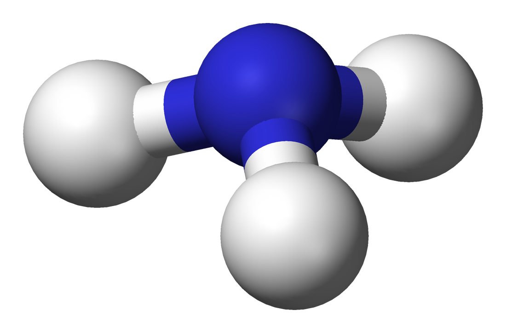
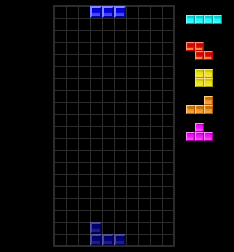

# 01: (title here)

## Off to school

“I’m off to school now, mom!”

“Take care out there and have a nice day!”

“Sure thing.”

Yep, this is yet another ordinary day. Walking on the streets carrying a school bag. The bag is silver with some white stripes and a blue/red keychain. I packed some notebooks and textbooks earlier last night so I have more time to go to school. That way, I can take a scenic route and probably explore a bit and hopefully not get lost.

Which school, you might ask? It’s Primp Magic School, it’s sorta like your regular school, but with specialization in magic. It covers students from middle to high school. They have your typical subjects like math, science, humanities, etc. But we also study about spells, magical beings, and more. I’m not personally a magic type person, but I’ll take a shot anyhow. I love to learn and explore new things. That’s why I pick this one.

There are not much restriction to school’s dress code, unlike some other parts of the world that has those ‘standards’. What I wear most of the time is a white t-shirt with a red-blue swirl in front. Then I layer it up with a navy blue hoodie jacket that I got from joining school’s chemistry club. It has this weird cyan-white circles connected with lines. This is an image of ammonia, or NH3, a chemical element of my choice, since it represents my name.

Speaking of name, I’m a fool not to introduce myself earlier. :sweat_smile: My name is Neo Hydrocube, or Neo for short. I came from about halfway through the country and moved here because my dad was assigned for duty in Primp Town about 2 years ago. Right now, I’m a year 2 student in Primp Magic School, basically an 8th grader. This place was strange at first, but now I feel like have grown here.

Throughout the days, I meet some people and some eventually become my friends. And speak of the devil, we have two of them right in front of school. “Fairy Fire!” The one shouting this is a blonde girl wearing flower-patterned shorts, a pink-blue hoodie, and the signature red hat with eyes. This is Amitie, a fellow classmate in Primp with a dream of becoming a great magician. She is the happy and fun type, but sometimes can be a bit clumsy and silly. Another girl replies with “Judgement!" (JP: _Jugem_) This one has a brown ponied hair, blue-white dress with skirt, blue wristband, and a chestplate. This one is Arle Nadja, a girl who got lost in this area and tries to get back home using magic. And yes, she is highly experienced in this field of study. She is a humble one with a positive spirit, but I heard from her other friend that she might be a bit “boy-ish”. I still don’t get it with that part. She’s perfectly fine as a girl, to say the least. Well, most of the time.

In front of them are a couple of boards that each of them manipulate. And occasionally they start throwing fire and ice at each other, sometimes thunder. What are they doing anyway? They’re playing a game of Puyo Puyo (a.k.a. Mean Bean Machine, Avalanche, and Puyo Pop), where they a given a “drop” of Puyos (singular: Puyo) and the task is to match similar-colored blobs in a group of 4 to pop them. When they pop, it releases a burst of energy that can be used to cast spells like “Fireball” and “Blizzard”. After they pop, blobs above will fall down the field and if another group matches and pops, it will create a chain, further amplifying the power output. And these girls are playing like pros, making big chains as high as 12 or more. On the other hand, I can barely make a consistent 7-chain.

Speaking of chains, here they are building a very high stack and they begin to chain. I try to keep track on how they build their stack and the number of chains ongoing. Both are making a big 15-chain. And at the end of their chains, they both shout out loud, “BAYOEN!!!!!” Both chains make such enormous power and...

**BOOOOM!!!**

I got knocked back from that shear mass of power onto the ground. Once I got back up, they just vanished. Well, here’s the side effect of playing the game. If enough energy is made, the player(s) may got warped into another part of the world. While mostly unintentional, one can purposely do this to visit another place. The problem is, we can hardly control where we might end up.

“Well, I hope they can go back here in time. It’s 10 minutes to the first class.”

## What was that?

Classroom 8-A. It’s math class soon, and everyone is enjoying their last minutes before the first bell. In one corner, a group of kids are takling about funny stories. In the front row, a boy with glasses carrying a book is arguing with a blue-blood girl over their best homework (we'll get to them later). And just right by the window, there’s a boy who couldn’t keep his eyes off a ladybug.

I start to approach this boy and initiate a topic. “Heya, Sig. Is your ladybug doing okay?” Yep, his name is Sig. He is the bug enthusiast around here. He holds one of the biggest bug collections in town in such an age. He is mostly pretty flat in terms of emotions, and he just goes with the flow. But believe me, behind that poker face, lies a deep sense of care for his friends. He is one of Amitie’s closest friends and sometimes hangs around with her, if he’s not busy chasing down exotic insects.

“Quite okay.” The ladybug begins to crawl into his left arm, which looks like a red claw. I don’t know why it’s like that. Neither does he, and he’s fine with it most of the time. At first, I thought he got hit by an insect that turned his hand like that. But that’s not the case. That’s another story for another time. “Neo, where’s Amitie?” he asks me.

“Probably she’ll be here soon. Just wait,” I reply.

“She’s not usually late.”

“I know, right. It’s 5 minutes to class and...”

_KYAAAAAAAA!!!!!!!!!_

“WHAT WAS THAT?” A girl just shouts in class pointing the windows, breaking our conversation. The entire room goes into a ruckus as kids huddling about the glass barrier. Sig and I almost get squeezed by them. Then, we followed along and look outside.

“What in the world...?” I said in surprise.

The clouds are gathering. Random objects fall from the sky. Some of which rotates by itself. Arranging and fitting into one another. Forming some... geometrical shapes?

(AN: the first 20 seconds of noob play)

“What are those things?” one boy starts a question.

“Are they going to fall right onto us?” another girl bumps in.

“Is this the end of the world?” another boy starts to freak out.

“So weird... yet so beautiful...” a pink haired girl reacted to this event.

“Is it a new type of Puyo?” another kid questions in awe.

“It’s obvious, is it? It’s a block. A magic block that rotates by itself,” a statement given by the nerd in class. This answers the first question, but not the last.

“Huh, what?” the bug boy next to me is confused.

“Blocks, eh?” I think... 

There is a pattern here. Each block has a color that tells its shape apart. One that look like a T is purple and an O-line square piece is yellow. One piece after another, they construct themselves in a certain way, filling gaps between the pieces. And then...

“Hey, is that a line?” Sig sees a white stroke of line from afar after a piece lands into a hole. In just a second, the line vanished and the pieces above continues to fall. And as a consequence, objects within the range of the line disappeared as well.

The reactions are mixed. Some are amazed, others scared, one part is intrigued, and another just “meh”. I fall into the third category. There’s something familiar about this. The shapes, the behavior, the color of the objects. I know I’ve seen this before. But where?
